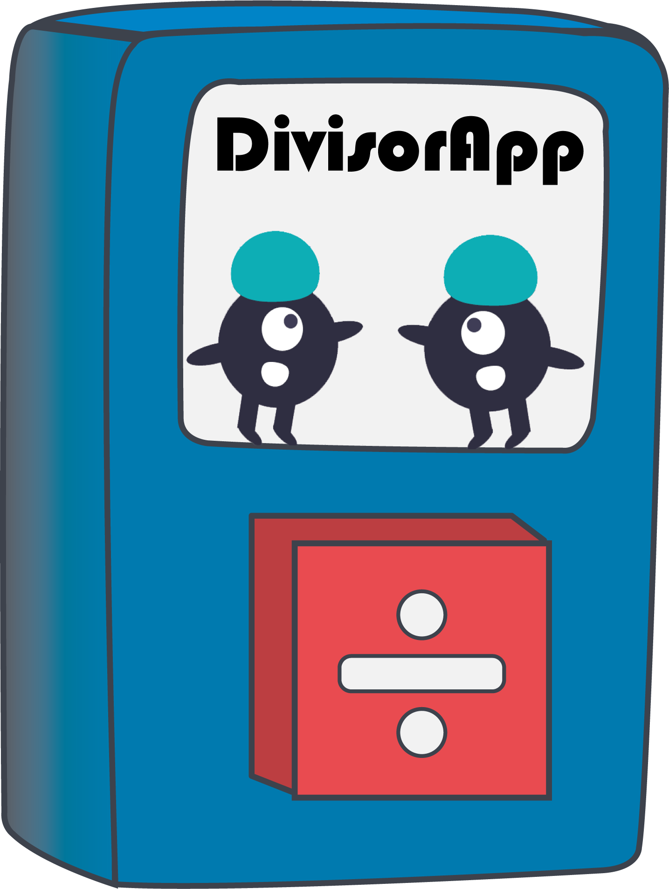
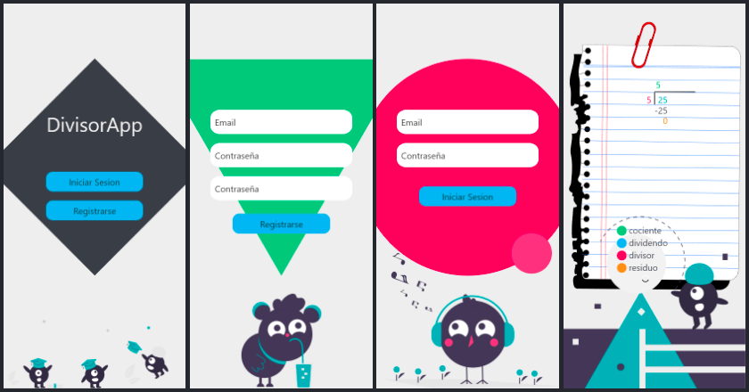

# divisor-app

DivisorApp es una aplicacion android diseñada para enseñar la operacion de division a niños que esten cursando entre 3° y 6° de primaria, ya que es en estos grados donde los alumnos tienen problemas para resolver esta operacion.

## Contenidos de la aplicacion

La aplicacion cuenta con diferentes interfaces como:
+ Pantalla de Bienvenida
+ Pantalla de Registro
+ Pantalla de Login
+ Pantalla de Division

La interfaz de registro pide unicamente un correo electronico el cual sera almacenado en Firebase para tener un control de el total de usuarios que usen la aplicacion.

La interfaz de login realiza la autenticacion con Firebase.

La interfaz de division es la aplicacion en si, donde los alumnos podran realizar la operacion y destingir los componentes de la misma.

